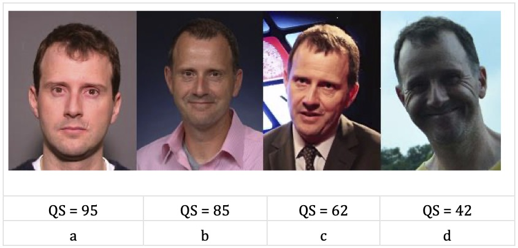
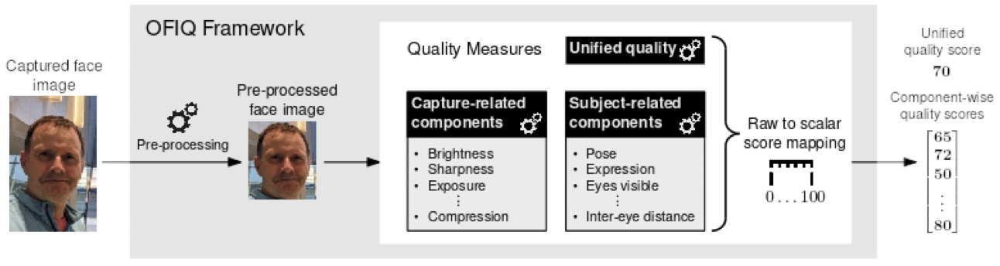

# Open Source Face Image Quality (OFIQ)

The __OFIQ__ (Open Source Face Image Quality) is a software library for computing quality 
aspects of a facial image. OFIQ is written in the C/C++ programming language.
OFIQ is the reference implementation for the ISO/IEC 29794-5 international
standard; see [https://bsi.bund.de/dok/OFIQ-e](https://bsi.bund.de/dok/OFIQ-e).

[Figure 1: Example of face images of a single subject with example quality scores (QS)](doc/reports/Short_Public_Report_V1.0_2024_09_30.pdf)

[Figure 2: Overview of the OFIQ Framework](doc/reports/Short_Public_Report_V1.0_2024_09_30.pdf)

| **Capture-related Quality Components**  | **Subject-related Quality Components** |
|:----------------------------------------|:---------------------------------------|
| Background uniformity                   | Single Face Present                    |
| Illumination uniformity                 | Eyes open                              |
| Moments of the luminance distribution   | Mouth closed                           |
| Over-exposure prevention                | Eyes visible                           |
| Under-exposure prevention               | Mouth occlusion prevention             |
| Dynamic range                           | Face occlusion prevention              |
| Sharpness                               | Inter-eye distance                     |
| No compression artifacts                | Head size                              |
| Natural colour                          | Crop of the face                       |
|                                         | Head pose                              |
|                                         | Expression neutrality                  |
|                                         | No head coverings                      |

[Table 1: List of capture- and subject-related quality components in OFIQ.](doc/reports/Short_Public_Report_V1.0_2024_09_30.pdf)

## License
Before using __OFIQ__ or distributing parts of __OFIQ__ one should have a look
on OFIQ's license and the license of its dependencies: [LICENSE.md](LICENSE.md)
  
## Getting started
For a tutorial on how to compile and operate OFIQ, see [here](BUILD.md).
For a tutorial on how to compile and operate OFIQ on mobile platforms, 
see [here](mobile/BUILD.md).

## Reference manual
A full documentation of __OFIQ__ including compilation, configuration and a comprehensive doxygen 
documentation of the C/C++ API is contained in the reference manual: 
see [doc/refman.pdf](doc/refman.pdf).

## Known issues
For a list of known issues, see [here](ISSUES.md)

