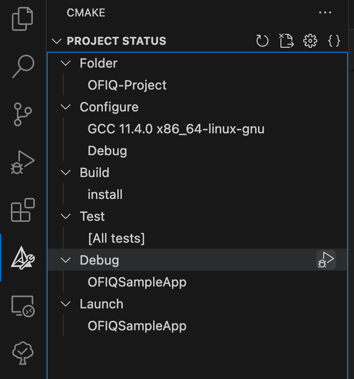

# Open Source Face Image Quality (OFIQ)

The __OFIQ__ (Open Source Face Image Quality) is a software library for computing quality
aspects of a facial image. OFIQ is written in the C/C++ programming language.
OFIQ is the reference implementation for the ISO/IEC 29794-5 international
standard; see [https://bsi.bund.de/dok/OFIQ-e](https://bsi.bund.de/dok/OFIQ-e).

## License

Before using __OFIQ__ or distributing parts of __OFIQ__ one should have a look
on OFIQ's license and the license of its dependencies: [LICENSE.md](LICENSE.md)

## Reference manual

The best way to get started, is to read OFIQ's reference manual:
see [doc/refman.pdf](doc/refman.pdf). The manual contains a documentation on
how to compile and run __OFIQ__.

## Set up project

1. Install miniconda
2. Create conda environment with

```bash
conda env create -n ofiq -f environment.yml
```

3. Install pre-commit

```bash
pre-commit install
```

4. Build dependencies

```bash
conda activate ofiq
cd scripts
sh build_debug.sh
```

5. Build project with VSCode CMake Tools

When building the project for the first time, make sure you download images and models. \
Configure `.vscode/settings.json` as follows:

```json
{
    "cmake.cmakePath": "${userHome}/miniconda3/envs/ofiq/bin/cmake",
    "cmake.buildDirectory": "${workspaceFolder}/build/build_linux",
    "cmake.configureArgs": [
        "-DCMAKE_INSTALL_PREFIX=${workspaceFolder}/install_x86_64_linux",
        "-DCMAKE_VERBOSE_MAKEFILE:BOOL=ON",
        "-DDOWNLOAD_MODELS=ON",
        "-DDOWNLOAD_IMAGES=ON"
    ],
}
```

6. CMake Configure Project

In VSCode, press `Ctrl + Shift + P` and select `CMake: Configure`

7. Debug project

Make sure your CMake configuration looks as in the following image and select "Debug":


## Run sample app

```bash
./install_x86_64_linux/Debug/bin/OFIQSampleApp -c data/ofiq_config.jaxn -i data/tests/images -o results/out.csv
```
